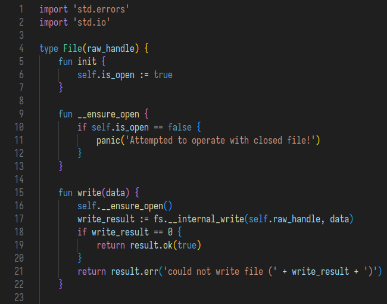

# watt-vscode

Syntax highlighting for Watt programming language.

## Features

This extension is used to enable syntax highlighting for Watt programming language.

## Release Notes

Users appreciate release notes as you update your extension.

### 1.0.0

Initial release.

### 1.0.1

Added icon

### 1.0.2

Lower version to be compatible with older versions

### 1.0.3

Add `else` highlighting

### 1.0.4

Add `and`, `or`, `in` highlighting

## 1.0.5

Add `match`, `with`, `impls`, `case`, `default`, `lambda` highlighting.
Add snippets.
